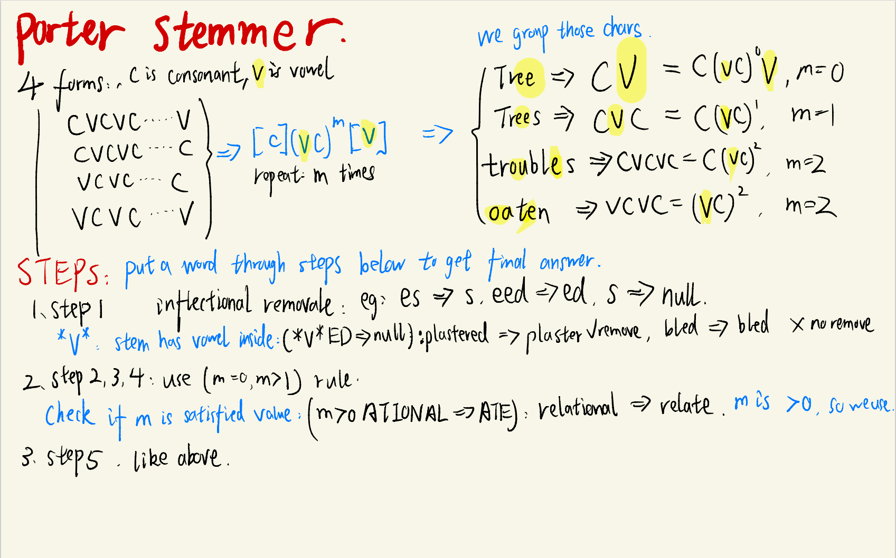

# NLP Revision

#### Preprocessing Steps
1. remove formatting (HTML).
2. doc->sentence, segmentation.
   1. rule based: split after full stop, issue: Human Name, U.S.A. use Lexicon to store all names, can't generate all
   2. use machine learning, SVM, LR, PoS tagging to determine sentences.
3. sentences->words, tokenisation.
   1. MaxMatch Algorithm: iteratively match longest words of string
   2. ***BPE*** Lecture2 P17: 
      - 1. get words 2. get chars frequency 3. get most common two. 4. subtract frequency 5. get most common three .... repeat.
      - divide to subwords, frequent words go full words, rare go subwords, worst case go individual chars.
4. words normalization (went->go).
   1. Goal: reduce Vocab size, map words to same type.
   2. Inflectional Morphology: "run -> runs", add s, es, ed, d, but word meaning, gramma is **NOT Changed**.
      1. lemmatise: simple remove added part. remove 'es' etc.
   3. Derivational Morphology: "write -> writer", add er, ise, word meaning, gramma is **Changed**.
      1. Stemming: 
           - remove whole suffix. "automate, automation, automatic -> automat", 
           - reduce more words, lexicon than lemmatisation. 
           - But can give non-meaningful token.
           - ***Porter Stemmer***: 1. inflectional removale 2. use rules..

         

   4. fix spelling error which can cause new type,words, disrupt linguistic analysis, can use string distance, n-gram, error types modelling.
   5. normalize->normalise spelling variations
   6. abbreviations expansion.
5. stop words removal
   1. **Not** appropriate when sequence is important.
   2. usually used in BOW method.
   3. high frequency or pre-built vocabs.

### N-Gram, Language Models
Use probabilities, derived from language models to do generation, query completion, character prediction, translation, sumarisation, measure fluent and goodness.
1. ***N-Gram***
   1. use Log-Prob to solve underflow
   2. unseen words: smoothing
2. ***Smoothing***
   1. Add K
      1. Laplacian smoothing (k=1)
      2. Lidstone smoothing (k=0.1)
         1. "Borrow" probs from each word's prob that:
         2. frequent words has lower probs.
         3. More frequent words give away more probs.
   2. Absolute Discounting
      1. Instead of dynamic "borrow", it uses fixed "borrow"
      2. deduct same amount for every words, frequency of words doesn't affect.
      3. Calculation
         1. calculate all probs, 
         2. subtract P for each word, 
         3. if we have N words, we have $N\times P$ total prob. 
         4. If we have M unseen words,
         5. every unseen word gets prob $N\times P \over M$.
   3. Katz Backoff
      1. Details:
         1. Based on Absolute Discounting, but
         2. instead of fixed $N\times P \over M$ prob,
         3. we use weight calculated from a *single* lower N-gram, $Weight \times$ $N\times P \over M$.
         4. $Weight$ could be unigram, probability of target appear in unigram.
         5. if 3-gram unseen -> 1-gram. (Only use a single lower gram model)
      2. Issue:
         1. Frequent Words get higher prob in step 3,4. common words get higher probs.
   4. Kneser-Ney Smoothing
      1. Based on Katz Backoff, but
      2. instead of using prob directly from lower N-gram model (Unigram frequency),
      3. it uses "versatility", "continuation probability" which is
      4. frequency of unique words combined with target.
         - measure versatility of words, "glasses" > "Francisco".
   5. Interpolation
      1. Combine all lower gram models together,
         1. weighted over 3-gram,2-gram,1-gram.
    $\lambda_1 P(target|Group)_{trigram} + \lambda_2 P(target|Group)_{bigram} + \lambda_1 P(target|Group)_{unigram}$.


### Text Classification
not restricted to below fact checking, paraphrase, input may not be long.

- Motivation, Classes, Features, corpora:
    1. Topic Classification: L4 P6 example.
    2. Sentiment Analysis: L4 P8
    3. Native-Language Identification: L4 11
    4. Natural lanaguage inference: L4 13

- Building a Text Classifier 9 steps: L4 P 14
(use test data to tune parameters instead of train+test)

- Bias vs Variance:
  - Bias: assumption of the model, may always predict one wrong answer. high bias, low overfitting.
  - Variance: model sensitivity/flexibility regarding data set. high Var, high overfitting.
  
1. Naive Bayes: P18
   - High Bias, Low Variance, Not Overfitting
   - Pros: 
     - High Bias, Low Variance. Less overfitting.
     - Fast To Train
     - simple to implement
   - Cons:
     - Need Smoothing
     - independent assumption (NLP, not good)
     - low performance in NLP
  
2. Logistic Regression L4 P 19
   - Pros:
     - deal with correlated features (vs Naive Bayes), better performance.
   - Cons:
     - Slow to train
     - Feature scaling
     - need lots of data
     - regularasation needed
   - Low Bias, High Variance, Overfitting

3. Support Vector Machine SVM P21
   - Pros:
     - Fast and accurate Linear Classifier
     - Non-Linearity with kernel trick
     - good for Huge dataset
     - good for huge feature set
   - Cons:
     - Multi class not good
     - Need feature scaling
     - imbalance data poorly
     - Interpretability

4. KNN : P24
   - Pros:
     - Simple but effective
     - No Training needed
     - Multiclass classification
     - optimal if has infinite data
   - Cons:
     - Manually choose K
     - imbalanced dataset problem
     - slow to calculate
     - feature need to be selected

5. Decision Tree
   - Pros:
     - fast
     - no need scaling
     - good for small feature sets
     - deal with problems non-linear separable
   - Cons:
     - interpretability
     - redundant sub-trees
     - can't do large feature sets, space, complexity etc
  
6. Random Forest
   - Ensemble classifier, sub-tree trained on sub-data and sub-features
   - majority voting at the end.
   - Pros:
     - more Accurate, robust than DT.
     - medium feature sets suitable
     - parallelised training
   - Cons:
     - Interpretability
     - Slow with large feature sets.

7. Neural Network
   - Pros:
     - Powerful, dominant in NLP and Vision.
     - no need feature engineering
   - Cons:
     - not off-the-shelf
     - optimise too many hyper params
     - slow to train
     - overfitting

#### Tuning Hyper parameters:
   - Use Dev set rather test or train.
   - Or, use k-fold cross-validation.
   - Grid Search.
   - Tuning for model and tuning for regularisation.
  
#### Evaluation:
   - Recall: correct/TotalClassNum
   - Precision: correct/TotalClassPreds
   - F1: Combined Precision and Recall.
   - Macro averaging: treat all classes the same, divided by number of classes
   - Micro averaging: weighted across classes, like accuracy, minority counts less, divided by number of data.

### Part of Speech Tagging:
word classes, classification of verbs, adj etc.

Need to know word classifications before do "information retrieval."

- Open(growing) vs Closed(fixed vocab size) classes:
  - Open:
    - Nouns:
      - Proper(special words) vs Common.
      - Mass(non-countable) vs Count (countable).
    - Verbs:
      - rich inflections (go,went,going)
      - auxiliary verbs (helping verb, do, have)
      - Transitivity (argument numbers), (wait, give)
    - Adj(gradable vs non-gradable[has level or not]), Adv.
  - Close:
    - Prepositions (in, on, with)
    - Particles (off)
    - Determiners:
    - Pronouns: Lec5 P 7
    - Conjunctions: P8
    - Modal verbs: P8 (can, should)
    - ....
Seen in all languages: Noun, Verb, not adj, not adv

- Issue: ambiuity, many words have multiple classes
  
Tags: P 15 (NNS, NNP etc)

####Why automatically POS tag?
  - important for morphological analysis: lemmatisation
  - some POS classes are useful (information retrieval)
  - features for classification tasks
  - reduce ambiguation. disambiguation.
  - create larger structures.

#### Tagger:
1. Rule-based tagger: NN after Verb etc
2. Unigram Tagger: most frequent tag for each word
3. Classifier-based tagging: use already classified + text -> tag class, error propagation, error add on each wrong prediction
4. HMM: 
   - no error propogation (by considering all probs), 
   - independent assumption make it tless sparsity, and fast.

Unknown words problem: use rule based (A comes after B), or sub-word representations.

### HMM
- Based on Bigram model. Better with trigram, state of the art
- Can generate data, generative model
- **not** discrimitive model, which most deep learning models use, describe P(T|W) directly.
1. Sequence Labelling, Structured Prediction:
   - decompose sentence-level task into small word-calss tasks
     1. model decompose process to word level steps
     2. but make prediction and learning using full sentence information, compare on a sentence-level.
     3. Therefore, no error propogation
2. ***HMM:***
   - want to find $P(types|sentence)$ and select highest prob.
   - $P(types|sentence) = P(sentence|types) \times P(types)$   --- Bayes rule, ignore denominator since word is fixed, we choose types.
   - $P(sentence|types) = \prod_{i=1}^{n}P(word_i|type)$ 
     - --- Strong Assumption: sentence is prob of words multiplied, Prob of word only depends on its POS tag 
     - *Output independence,*
     - *emission prob*
   - $P(types) = \prod_{i=1}^{n}P(t_i|t_{i-1})$ 
     - --- Prob of tag depends on previous tag 
     - *Markov assumption*
     - *transition prob*
   - Training: MLE
     - *emission prob* $P(word_i|type)$ = Count(word_i, type) / Count(type)  -- like unigram.
     - *transition prob* $P(t_i|t_{i-1})$ = Count(t_i, t_{i-1}) / Count(t_{i-1})  -- like unigram.
     - can use smoothing in n-gram
     - \<s> denote the type for starting symbol. L6 P7

   #### Viterbi algorithm: L6 P15
   - Complexity: L6 P39
   - Work assumptions: strong assumptions stated before.
   - use log probs to avoid underflow.
   - use vectorisation (matrix and vector operations)
   - based on bigram
   - better with trigram, state of the art

### Neural Network (Feed-Forward NN)
- Activation function f = tanh(W*X), normalize, output to same scale.
- SoftMax, output to class probs: exp(a)/sum(exp(..))
- Train: maximise L =  product of (probs of each correct class), for example
  - we have n data, m labels, L = for each data in n do: multiply probs of its correct label. maximise L
  - equals to minimise -log(L)
- Prediction: select highest prob class as prediction. See below
- Prevent Overfitting:
  - L1 Norm Regularisation: more 0, sum abs value.
  - L2 Norm: more small value, sum square of value.
  - Drop out layer: prevent dominant feature, prevent model rely on part of neurons, introduce noise.
  
- Advantage:
  - capture word properties, robust estimate
- Disadvantage:
  - slow to train
  - capture only limited context n gram
  - can't handle unseen words.

#### Word Embeddings
map word symbols to continuous vectors, allow model to capture similarity between words.
  - input -> first layer, W1: weights are in fact word embeddings. say fully connected: 3 input words to 5 hidden layers, each word embedding is length of 5, each element is this word weight towards different hidden neuron, so word1 -> [w1,w2,w3,w4,w5], word2->[q1,q2,q3,q4,q5], word3->[c1,c2,c3,c4,c5].... we have total 15 weights. first neuron in first hidden layer: w1+q1+c1, sum of neurons in first hidden layer = first hidden layer = sum of input word embeddings.
  - first layer: sum of input word embeddings [w1+q1+c1, w2+q2+c2, w3.....], so
  - predition!: 
    - input word embedding, add element-wise wor1+wor2+word3, input as a value of first hidden layer size=5,then use weight W2 to predict.

All problems: Limited context, can only use n-gram, a few words to generate next.

### ***Recurrent Neural Networks*** (RNN)
use state vector to store previous information
$f(s_i) = f(s_{i-1}, x_{i})$ state = f(prev_state&cur_input)

- Vanishing Gradient: expanding RNN gives us a very deep MLP, with even every weight in each layer is the same, so the update tends to be decreased exponentially, additionally, sigmoid function will cause problems.
  - https://towardsdatascience.com/the-vanishing-gradient-problem-69bf08b15484

- Training: use cross-entropy, L = L1+L2+L3, where Li = -log(P(correctlabel))
- Generating: use prediction function (see notes. yi = sigma(W*S)) as a input to next layer.
   - Problems:
     - Mismatch between training and decoding
     - error propagation
     - generation will be using most common words.

### ***Long Short-term Memory (LSTM)***
L8 P26 **P33**
 - Forget Gate: forget stuff in memory cell
 - Input Gate: how much information to put in memory cell
 - Update Memory cell using forget gate + input gate
 - Output Gate: use how much of current memory cell to output next state.

- Advantages:
  - Capture long range contexts
  - flexible like MLP.

- Disadvantages:
  - still unable to capture very long info
  - much slower to train/test, can't parallel due to sequential implementation
  - doesn't stack well, multilayer LSTM is not good.
  - less popular due to transformers.

#### Important: the final output state for RNN or LSTM will be used, only last hidden state will be used.


### Lexical Semantics
Capture word meaning in a lexical database
- Not dictionary meaning (could result in a loop)
- Learn relationship with other words (also circular but better to ML).

Problem:
  - Manually constructed, expensive, biased and noisy
  - Dynamic Language, new words, senses

Gloss: dictionary meaning

Polysemous: word with more than one senses (meaning).

- Synonymy: similar
- Antonymy: opposite
- Hypernymy: catogorical is (*cat* vs *animal*, *mango* vs *fruit*)
- Meronymy: part-whole (leg vs chair, wheel vs car)

WordNet: database of all above relations (also in NLTK). Information store as synsets (group of word has similar sense) rather than words.

#### Measure similarity using WordNet
1. ***Word Similarity***
2. Word Sense Disambiguation: select correct meaning of the word in sentence. (Less popular, the related information can be captured by contextual information.)
   - Supervised: standard ML, require context sense information as input, hard to get, otherwise context is ambiguous too.
   - Unsupervised: 
     - Lesk: choose gloss(dictionary definition with most overlapping sense.) overlapping words in meaning definitions, majority voting.
     - Clustering: cluster on sentences with word, to get different sense (meaning).
       - Cons: need to match with the dictionary definition (not we created new sense) and lack of  interpretability


### Distributional Semantics
Use topic similarity by their co-occurence.
- Document context.Co-occurrence in the document indicating similar topic.
- Local context (small window), "eat a pizza" and "eat a burger", reflects meaning.

#### 1. Learn meaning based on usage
Only know True/False.
#### 2. Word Vectors:
Can Learn the degree of similarity!

describe distributional properties of a word (information of its conext words).
Capture all sorts of semantic relations, synonym .... etc.

#### 2.1*** Document as Context: The Vector Space Model ***
  - Use TF-IDF instead of frequency.
  - Dimensionality Reduction to create dense matrix:
    - ***Singular Value Decomposition*** (SVD, truncate Latent Semantic Analysis)

Or, we can use Word as Context (inside a small window, count frequency (can't use TFIDF!))

#### PMI Pointwise Mutual Information  Lect10, P17,18
- $Log_2(\frac{\frac{Count(x,y)}{totalwords}}{\frac{Count(x)}{totalwords}* \frac{Count(x)}{totalwords}})$  each count(a,b)/totalwords is the probability of a and b occur together in text.
- biased towards rare word pairs, denominator small.
- Doesn't handle zero well (goes to -inf)

PMI tricks:
- Remove negative values to 0
- Normalised PMI to counter bias: PMI(x,y)/(-log(P(x,y)))

#### Word2Vec
- Skip-Gram: predcit surrounding of a single word. P34
  - Slow, trying to maximise likelihood of raw text
  - solve: translate to binary problem (T or F), T: Raw Text, F: randomly draw negative samples.
- CBOW: predict single word given its surrounding. (With in L=2 Positions, use front 2 + back 2 = Total 4 words to predict)

Problem: 
1. quantify the quality of words
2. can't capture polysemous words

But it is easy to input to neural network downstream tasks,
It is also good to demonstrate geometry, for examle, which words are similar/close.


### Contextual representation
Unlike Word2Vec which has fixed vector, contextual word vector varies based on context (capture multiple senses).

#### ELMO Embeddings from Language Models, L11 P9
- think of RNN, RNN produce a final state vector S (which is contextual representation), we can use (S, U) to get a bidirectional tuple of context (U is the output of other direction)
- Basic Idea:
  - Input words -> *1. words embeddings* as input, embedding has N length.
  - With a pair of 2-layer bidirectional LSTM (LeftToRight and RightToLeft, with 4096 hidden dimension) =>> *2. 4 outputs* (each direction and each layer).
  - concatenate (a)(b) -> (a,b) for output of two directions for each layer (length N -> 2N)
  - weighted over 1.embeddings+embeddings + 2. first layer concatenated(a,b)[syntax layer], second layer (a,b)[senses layer], produce a total embedding (length 2N)
  - Use this 2N input embedding as input to other neural network classifer.
- Probelm:
  - Interpretability
  - difficult to do similarity betwwen words.
  - slow to train large-scaled.

#### BERT Bidirectional Encoder Representations from Transformers, L11 P24
  - Can't generate language since we need bidirectional context
  - masked langauge model (mask out words, train the model trying to predict words.)
  - or predict if next sentence is suitable.
  - pre-trained model, can fine-tuning the model use further data, with a classification layer on top (still part of the BERT! So update across the whole model!)

#### ELMO vs BERT:
- ELMO only generate word embeddings, then, use these embeddings to input to do classification (two separate models).
- ELMO only learn weight when combining embeddings. 
- BERT can add a classification layer, no task-specific model needed, so they are as a whole.
- BERT learn and update all weights when fine tuning.

#### Transformer:
- Weighted sum over (target word) and (its surrounding context words) to get a final embedding layer.

### Discourse
How sentences relate to each other in a document
- Discrouse segmentation (document divided into chunks)
- Discourse parsing (relation between sentences)
- Anaphora resolution (who, where, how)

#### TextTiling: find a point to divide document to two parts P9
get K sentences from two sides and use BOW and cosine similarity, if difference is large (threshold T), set point.

#### Discourse Parsing
- Rhetorical Structure Theory (RST), framework if we have discourse units and relations between them

Discourse Units DU: part of the sentence, can combine together

Relations: conjunction, justtify, elaboration etc

  - Nucleus: primary DU
  - Satellite: supporting DU (elaboration of a sentence)
  - or, we can have equal relations (2 Neucleus)

RST tree : combining multiple DUs to composite DUs
- rule based discourse marker.
- machine learning.
  - Bottom-Up Parsing: Greedy shift-reduce (local, fast), CYK (global, slow)
  - Top-Down Parsing: 1. segment doc to DUs. 2. separate to boundary 3. repeat step2.

Application: Summarisation, sentiment analysis, argumentation(find core sentence), authorship identify, essay scoring.

#### Anaphora resolution (who, where, how) Lec12 P36
Identify who that "he" refers to, etc should be recent and salient(important).

Centering Theory: unified account of relationship between discourse and entity reference.


### Formal Language Theory
- define if a string belongs to a language, how? define its grammar.
- score if the string is acceptable
- translate


#### Finite State Acceptors
Given input of regular language (can express with regular expressions), determine their membership relations (if there are paths to connect from start to end, might need to write RE for a graph).  Lec13 P17
- For word Morphology: use FSA to determine if the word has valid inflections (allure -> afflureful)


### Context-Free Grammars
Capture non-regular languages

W -> X Y Z   (W can only be Terminal, X Y Z can be Non-Terminal)
- Terminal: word, "book"
- Non-Terminal: syntactic label, NP, CP
- Start Symbol: S
- context-free: only depend on LHS, behaviour only depends on current state
(Language is not completely context-free!)

#### CFG parsing Lec14 P6
represent English grammars
- Constituents: 
  - Movement: part of the sentence, can be swapped "give (a fish) to (her brother)".
  - Substitution: can be replaced by other Constitutents.
  - Coordination: can be joined by "and", "or"
  - can be decribed by phrases.
  
Generate sentence with CFG, Lec14 P17,18... and P20

#### CYK Algorithm
dynamic programming example, like HMM

check if a sentence is valid given CFG tree (Chomsky Normal Forms).

- Chomsky Normal Form: in a form of 
  - A -> B C, A -> a (non-terminal)
  - Rules (how to convert to CNF):
    1. A -> B cat
        - A -> B X
        - X -> cat
    2. A -> B C D
        - A -> B Y
        - Y -> C D
    3. A -> B, B-> cat, B -> dog.
        - A -> cat, A -> dog
   - X and Y are new symbols

- Other steps: See notebook

#### Probabilistic CFG : solve ambiguity when multiple trees appear

NN -> cat, NN -> dog, NN -> beef

every rule has its probability, denotes $P(cat|NN)$ all NN should sum up to 1.
- Starting the CFG tree from S
- randomly select RHS|S based on its probability distribution
- therefore, generate a random tree.
- P(tree) = all Probs time together.

See Notebook.
- Rules:
    1. A -> B C D   prob: 0.10
        - A -> B X  prob: 0.10
        - X -> cat  prob: 1.0

CFG Problem:
  - poor independence assumptions, can't capture contextual differences in PCFG. (differences between subj, obj, L15, P41,42) add symbol to differentiate.
  - Lack of Lexical conditioning: P44,45,46
    - For example, (dog in house) (cat)  >> (dog in) (house or cat)
    - Solution, duplicate parent when creating tree, for example, dogx2  P 47
    - results in huge trees.


### Dependency Tree

Projectivity: if from head, can go to every node (can use other nodes as media).

Tree is Projective: No crossing edges, all its arcs are projective.

We can construct dependency tree from constituency tree (CFG tree) by finding its head and determine the relation underlying.

Two way to construct:
  - transition based: See Notebook Transition-Based Parsing
    - works only with projective trees.
    - three actions: shift, left-arc or right-arc
    - remove child after right-arc or left-arc (if it is right-arc, remove right element since we find a way to go to right element.)
    - Stack: current we look at, Buffer: next input
    - example P29, P35
    ``` Parsing Classification: L16 P37```
  - graph-based parsing P41
    - Adavantage:
      - produce non-projective trees (suitable for other languages)
      - score entire tree, no local decision like transition-based (two nearest), also can capture long dependencies.


### Machine Translation
Difficulties: not simple word to word, it needs structural changes, idioms, gender inflections etc, missing information (determiners)

- Statistical ML:
  - Bayes based: if we want to know best english sentence for this french sentence (argmax of P(Eng|French)).
  - P(English|Franch) = P(Franch|English) * P(English)
  -  likelihood = Translation model TM * Langauge model LM
  -  LM: monolingual corpora (only ENG)
  -  TM: parallel corpora (ENG-FRENCH sentence pairs)
     -  How to learn word to word translation in parallel corpora?
     -  use word alignment, algorithm, EM etc
  - Difficulties:
    - maintain hard
    - new language pairs need more work
    - tons of feature engineering (alignment) and complex

- Neural Machine Translation:
  
  use neural network: use encoder-decoder model, RNN to encode and decode. 
  - encoder RNN 1st: original sentence -> final hidden state
  - decoder RNN 2nd: 
    - Train: use initial state as previous "final hidden state", input is the target sentence. (since training we have target sentence as well)
    - Test: use RNN's generation function, predict next word (highest prob) and use it as input target word [error propagation, greedy algorithm, for global optimum, lec17 pa31]
    - Loss: log negative prob of target words sum up together.
  - it is a Conditional Language model:
    - P(Eng|Franch) = P(E1|Franch) * P(E2|E1, Franch)...P(Eng_words|Franch), where Eng_words is in the decoder 2nd RNN, Franch is in encoder 1st RNN.  (it is based on previous words after the translation + original sentences)
  - since the "Test" process involves using own prediction as input to next, can't find optimum, solution:
    - choose top k words as input, compare together, Lec17 P32-40

  - Issues:
    1. whole original source is represented by only a single vector(information bottleneck)
    2. create new details (hallucination)
    3. interpretability 

- Attention Mechanism:
  
  instead of using last hidden state, we use weighted dot product across all hidden states of the original sentence (1st encoder RNN).
  Then we generate a softmax distribution to select which word Lec17 P46---.  
  - Solves information bottleneck as it get access to whole source sentences,
  - improved interpretability (attention weights as word alignment weight/probs)
  - state-of-the-art

- Evaluation:
  - BLEU: overlap proportion between source and taget based on 1-4gram. Lec 17 P55


### Information Extraction Lec18

1. Named Entity Recognition (NER): itentify special names, mainly sequence models, RNN, HMM.
2. Relation Extraction: get the underlying relations, classifiers mainly.

Entity Tags: Lec18, P10

#### Named Entity Recognition (NER)

Change the tags, IOB tagging, inside, outside, begining tagging Lec18 p12,13
- intuition: "American Airlines corp" are all oranisation words, need to define which one is the first, which one are not related etc.
- Example:
  - Steve Jobs founded Apple Inc. in 1976.
  - tags: B-PER, I-PER, O, B-ORG, I-ORG, O, B-TIME.
- NER features: shape of the word(capitalise etc), Xx, Xx. x etc, Lec18, P17
- NER classifier: given input a sequence of words and its corresponding NER features (including tags), predict next tag.

Two methods
- Rule based, "A such as B" -> hyponym(A,B)
  - high precision, low recall, manual effort needed
- Suvervised ML:
  - get all pairs in sentence
  - 1. binary classification select related pair
  - 2. use SVM on related pair to get their relationship.
- Semi-supervised:
  1. known tuple *relation(A,B)*
  2. find sentences has *A,B*
  3. extract patterns in sentence.
  4. extract similar tuple in position of *A,B*, got *relation(C,D)*
  5. use *C,D*, repeat whole steps.
  - issues:
    - extraction deviates overtime
    - difficult to evaluate
    - general patterns could be noisy
    - semantic drift (should only accept high-confidence patterns)


### Question Answering
auto answer factoid question (short precise answer)
1. Information Retrieval based
   1. build question steps lec19 p9-11
   2. need to predict answer type.
   3. retrieve passage (sentences) from n documents (match converted question with existing text data (pattern matching the passage) ) P13
   4. extract answer with the same answer type
    - MCTest, Squad, reading comprehension (predict start index and end index of the answer)
    - LSTM, BERT based P19 onwards
    - Evaluation, scoring for them on P36
2. Knowledge based
   - hard to convert string to logic tuple
   - query the knowledge database using logic tuple sql
3. Hybrid
   - Watson Lec19 P31
      1. generate candidate answers from text and knowledge source
      2. use evidence to score them


### Topic Model
unsupervised
1. assign words to a topic
2. assign docs to topics

- Latent Semantic Analysis L20, P12
    - Use singular value decomposition SVD to get word embedding and document topics.
    - negative value, not good
- Probabilistic LSA 
  - P15, get probability for LSA, no more negative.
  - it needs to be re-trained for new documents
  - Can NOT infer topic distribution on new topics! (it needs P(word|topic) P(topic|doc) to calculate which is unknown for new docs)
  
#### Latent Dirichlet Allocation

Learn which words tend to appear together -> a topic
more words in that document -> assign topic to that doc

  - Bayes version of PLSA, introduce prior.
  - assume each doc has a mix of topics, with hidden latent topic distribution.
  - using docs and words to infer topic distribution.
  - use Soft cluster rather than hard.
  - documents + BOW
    - remove stopwords
    - remove low,high freqs words
    - lemmatise

Sampling based algorithm to learn latent topics. Lec20 P24.
  1. randomly assign topics to each words (lemmatised tokens) in document (orange chart).
  2. collect count of topic|words and count of topics|docs into two matrixs (blue and green).
  3. For each word in orange chart, use probability distribution to sample and generate its topic.
      $P(new topic|this token) = P(topic|this token) * P(topic|doc of this token)$
        *Need to remove current token from our blue and green matrix (since we are generating (sampling) new topic for this token!)*
  4. Repeat untill prob distribution stable. P27
  5. Therefore, we have stable topic for each token, and stable topic for each doc.

- Prediction:
  - use trained word-topic matrix and prob distribution to generate topic for every word in the document.
  - keep word-topic matrix fixed
  - update topic-doc matrix since that's what we need to predict
  - need to repeat this process untill topic-doc matrix stable.
- Hyperparameters: P30
  - P31 High prior: flatter distribution
  - otherwise, peaky strike distribution
- Evaluation:
  - Perplexity: formula P33
    - issues:
    - more topics, better, lower perplexity
    - smaller vocabs, better perplexity,
    - just like AIC, it needs to compare within same corpora, same preprocessing methods
  - UseDownstream task performance！
    - 1. Check topic coherence:
      - random inject non-topic words, check if our model can detect it. need manual efforts, not scale.
    - 2. Check word-wise PMI:
      - higher PMI for every pair (sum over all pairs), means words are related
      - better to use other external corpora to validate
    - 3. Normalised PMI: penalise for rare words (rarer words get higher PMI, since they are narrowlly specifically used.)


### Summarisation
outlines, abstracts, headlines, shippets

Two types:
- single doc summarisation
- multi doc summarisation

How to?
- Extractive summarisation (select sentence)
- Abstractive summarisation (own words)

Goal:
- Generic: get important information
- Query-focused: answer non-factoid question

#### Extractive single doc

1. content selection: select sentences
2. information ordering: how to order sentences from 1
3. sentence realisation: cleanup to make sure sentences are fluent.
   

#### 1. Content Selection Lec21 P12
  1. TF-IDF to get important words
  2. Log Likelihood Ratio P12
      - if a word prob in doc differs from prob in corpora, it is important in doc!
      - Threshold Lec21 P13
      - After getting weights for each word,
      - salient of a sentence, length S: sum(all words weights) / S. (removed stopwords)
  3. Sentence Centrality
    - choose sentence with small distance to all other sentences
    - use TF-IDF and Cosine similarity
  4. RST parsing
    - can illustrate how sentences are connected
    - nucleus are more important than satellite
    - a sentence acts as nucleus to more others = more salient, important

#### 2. Information Ordering Lec21 P27
 - order by document dates
 - order makes adjacent sentences similar
 - order using centering theory, how entities are organised

#### 2. Information Ordering Lec21 P28
- make sure entities are refered coherently.
  - 1st mention: full name
  - 2nd mention: last name

- singledoc
  - content selection, no need ordering, no need realisation if in dot point
  
- multi-doc, similar, but redundant information, need ordering
  - select all sentences from top down best which are novel! unique ideas,
  - penalise similar sentences

#### Abstraction:

  - use encoder-decoder model to generate abstract information of full doc
  - Improvements:
    - use attention
      - issues:
        - generate new detail (encoder issue)
        - unseen words problem
    - richer word features, pos tags, ner tags, tf-idf
    - hierarchical encoders:
      - one LSTM for words
      - another LSTM for sentences
  - Copy mechanism (use document as part of the corpos):
    - use input source + existing document information
    - generate summaries that reproduce details in the document
    - produce out-of-vocab words in the summary by using, count, copy them in the document 

Evaluation ROUGE: P 47  (similarity of n-gram overlap)


### Ethics

Why is Ethics Hard?
 - no objective truth, unlike sciences.
 - think from different perspectives to justify our reasons.

NLP:
  - Bias
    - a model is biased if it performs unfavourably against certain groups of users (based on gender or ethnicity)
    - could be good, no bias model is random classifier.
    - word embeddings man-woman = king-queen, or  = docter - nurse?
  - Dual use
  - Privacy
    - nobody know I am doing something
    - Anonymity: know something is done but don't know it is me


